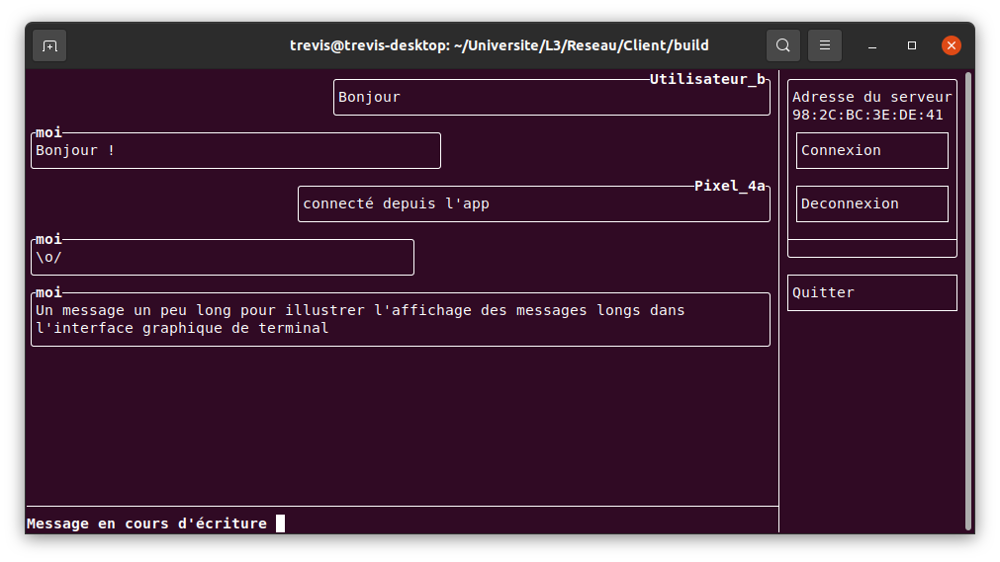
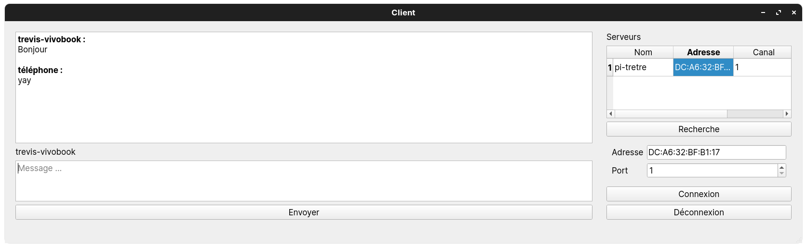

# Client

Client pour le projet de Réseau, peut se connecter en bluetooth au serveur correspondant (https://github.com/tretre91/ServeurProjetReseau)

## Build

Pour compiler utiliser cmake :

```bash
cmake -S . -B build -G "Unix Makefiles" # -D GUI_CLIENT=ON pour compiler l'interface graphique (voir plus bas)
cd build
make client     # pour le client simple
make tui-client # pour le client graphique dans le terminal
make gui-client # pour l'interface graphique classique
```

## Usage

### Client simple (stable)

Pour lancer le client et se connecter au premier serveur disponible :

```bash
./client
```

Pour se connecter à un serveur en particulier :

```bash
./client adresse_du_serveur
```

on peut également spécifier le canal utilisé avec un 2ème argument.

Messages spéciaux :
- `stop` : pour se déconnecter
- `username nouveau_nom` : pour changer de nom d'utilisateur

### Client console graphique (wip)



Utilisation :
- Lancer avec `./tui-client`
- Enter l'adresse bluetooth du serveur dans le champ "Adresse du serveur"
- Cliquer sur connexion
- Écrire un message dans la zone de texte du bas ("> ")
- Appuyer sur entrée pour envoyer

Messages spéciaux :
- `stop` : déconnexion (équivalent au bouton "Déconnexion")
- `!username nouveau_nom` : pour changer de nom d'utilisateur

Les navigations à la souris et au clavier sont supportées

Remarque : Il faut cliquer sur la zone des messages pour pouvoir scroller.

### Interface graphique



L'interface graphique requiert [Qt](https://www.qt.io/) (au moins version 5.2) pour être compilée.

Utilisation :
1. Lancer :
    - Depuis Qt Creator
    - Sans Qt Creator, spécifier l'option `-D QT_DIR=/path/to/qt` lors de la configuration (le dossier est de la forme `/home/trevis/Qt/5.15.2/gcc_64`) et lancer avec `./gui/gui-client`
2. Rentrer les infos du serveur
    - Entrer manuellement l'adresse bluetooth du serveur et le port
    - Cliquer sur `Recherche` et attendre quelques secondes, puis cliquer sur un des résultats pour remplir les infos automatiquement
3. Cliquer sur `Connexion`
